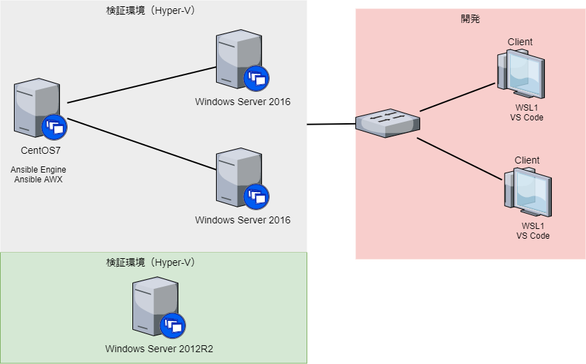

# Tryal Ansible 

## 目的

1. Ansible 独習
2. Windows Server の設定を Ansible Engine を使用して自動化する
3. Ansible AWX を使用して学習する

## ディレクトリ構成

* try_ansible\
  * inventory\
    * group_vars\
    * host_vars\
    * hosts
  * win_playbooks
    * ansible.cfg

## システム構成概略

