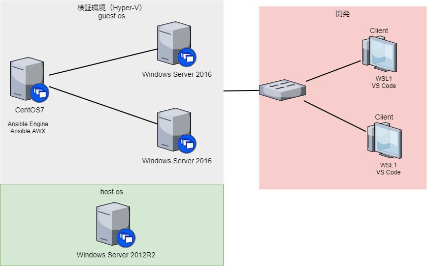

# Tryal Ansible 

## 目的

1. Ansible 独習
2. Windows Server の設定を Ansible Engine を使用して自動化する
3. Ansible AWX を使用して学習する

## ディレクトリ構成

* try_ansible\
  * inventory\
    * group_vars\
    * host_vars\
    * hosts
  * win_playbooks\
    * ansible.cfg

## システム構成概略




## win_command／win_shwll で ipconfig や w32tm などの stdout,stderr が文字化けする場合の対処

* .local/lib/python3.6/site-packages/ansible/module_utils/csharp/Ansible.Process.cs
* .local/lib/python3.6/site-packages/ansible/module_utils/powershell/Ansible.ModuleUtils.CommandUtil.psm1
* .local/lib/python3.6/site-packages/ansible/modules/windows/win_command.py
* .local/lib/python3.6/site-packages/ansible/modules/windows/win_command.ps1
* .local/lib/python3.6/site-packages/ansible/modules/windows/win_shell.ps1
* .local/lib/python3.6/site-packages/ansible/modules/windows/win_shell.py

これらを、変更する。下記参照

* [Add encoding and codepage params to win_command/win_shell (ansible#54896](https://github.com/anshulbehl/ansible/commit/3bd12ed9e7f724bcd9c27fb88a1fb9f60c28c3be)
* try_ansible\custom_win_modules\
* output_encoding_override の設定値は、[windows encording codepage](https://docs.microsoft.com/ja-jp/dotnet/api/system.text.encoding.getencodings?view=netcore-3.1)を参照

```yml
# playbook example
win_command: ipconfig
args:
  output_encoding_override: shift_jis
```